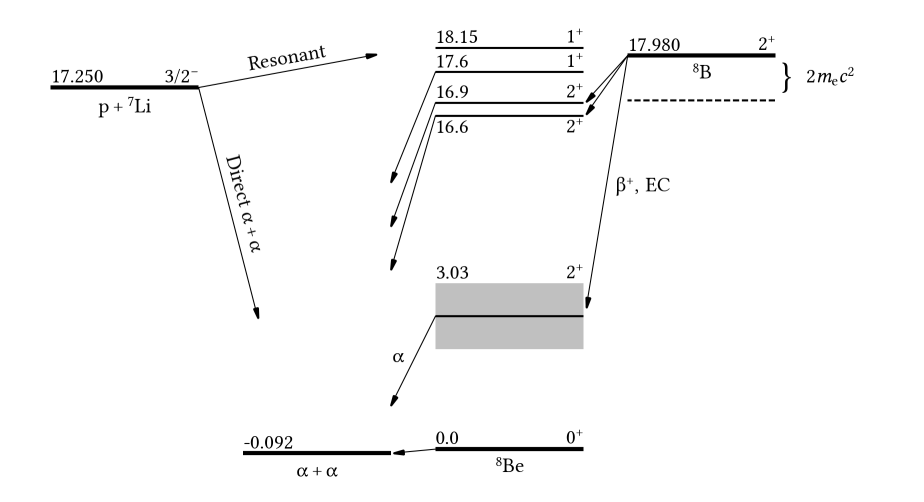
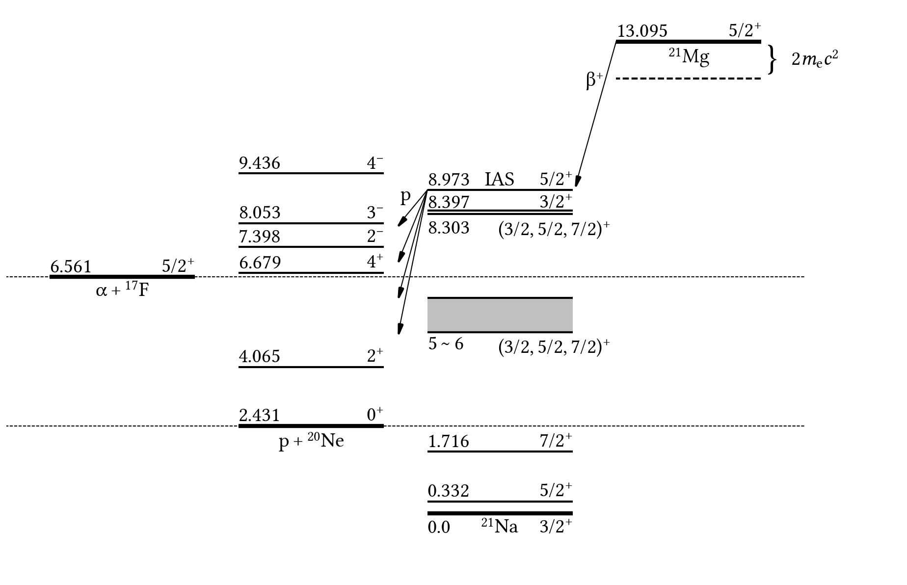

# DecSD (Decay Scheme Drawer)

Draw decay schemes easily by modifying the included examples.

Suggestions for/contributions of examples are very welcome.

**Example 1**

**Example 2**

**Example 3**

**Example 4**

Another take on the 21Mg decay scheme: All levels reported in ENSDF jan. 2015

**Example 5**
Another take on the 21Mg decay scheme: Less demonstrative, more illustrative than example 1.

